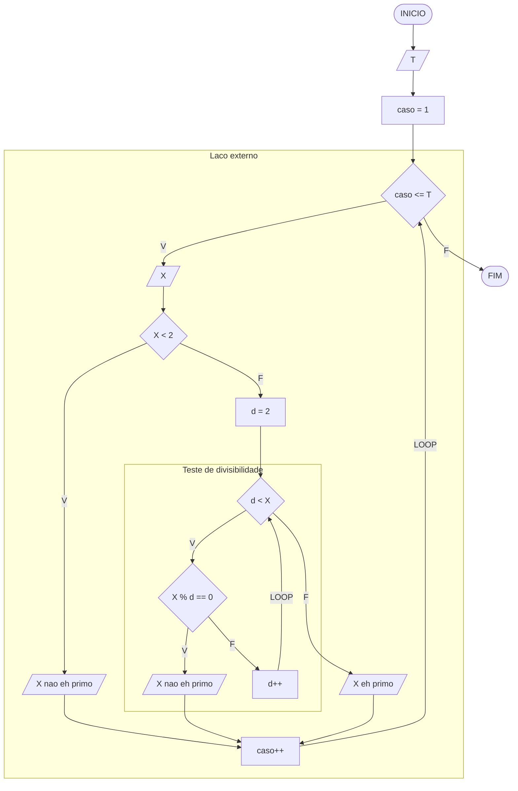

# BEE1165 - Numero Primo

## Fluxograma

```mermaid
flowchart TD
A([INICIO]) --> B[/"T"/]
B --> C["caso = 1"]
C --> D{"caso <= T"}
subgraph SEQ1 [Laco externo]
D -- V --> E[/"X"/]
E --> F{"X < 2"}
F -- V --> G[/"X nao eh primo"/]
F -- F --> H["d = 2"]
H --> I{"d < X"}
subgraph SEQ2 [Teste de divisibilidade]
I -- V --> J{"X % d == 0"}
J -- V --> K[/"X nao eh primo"/]
J -- F --> L["d++"]
L -- LOOP --> I
end
I -- F --> M[/"X eh primo"/]
G --> N["caso++"]
K --> N
M --> N
N -- LOOP --> D
end
D -- F --> O([FIM])
```
