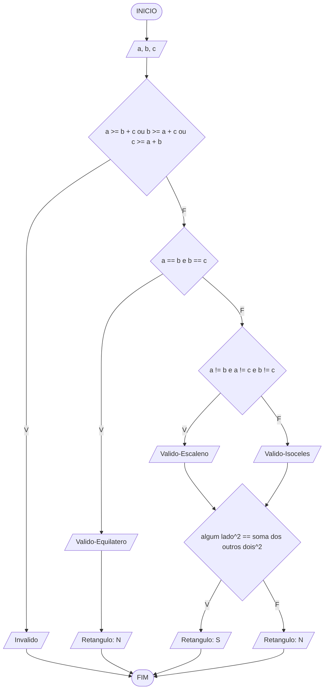

# BEE2313 - Qual Triangulo

## Fluxograma

```mermaid
flowchart TD
A([INICIO]) --> B[/"a, b, c"/]
B --> C{"a >= b + c ou b >= a + c ou c >= a + b"}
C -- V --> D[/"Invalido"/]
C -- F --> E{"a == b e b == c"}
E -- V --> F[/"Valido-Equilatero"/]
F --> G[/"Retangulo: N"/]
E -- F --> H{"a != b e a != c e b != c"}
H -- V --> I[/"Valido-Escaleno"/]
H -- F --> J[/"Valido-Isoceles"/]
I --> K{"algum lado^2 == soma dos outros dois^2"}
J --> K
K -- V --> L[/"Retangulo: S"/]
K -- F --> M[/"Retangulo: N"/]
D --> N([FIM])
G --> N
L --> N
M --> N
```
